# Automation via Logic App

Logic App workflows are a great way to provide automation scenarios, and
in the case of calling Synapse Pipelines it’s very easy. Due to the
nature of the data in MGDC, we need to call the pipeline with a specific
set of dates. If the provided dates are the same, then a full pull is
initiated. If the dates are different, a delta pull is initiated. The
below example will walk through the configuration of a workflow that
does a delta pull once a month.

## Create Logic App to call Pipeline Trigger

### 1. Create a new Logic App

<table style="width: 100%">

<colgroup>
<col style="width: 43%" />
<col style="width: 56%" />
</colgroup>
<tr>
<td>1. Create a new Logic App</td>
<td>Name it what you’d like, for example: <em>MGDCSPOKickoffSynapsePipeline</em></td>
</tr>
</table>

### 2. Trigger to Run

<table style="width: 100%">
<colgroup>
<col style="width: 43%" />
<col style="width: 56%" />
</colgroup>
<tr>
<td>
1. Select <strong>Add a Trigger</strong>
</td>
<td>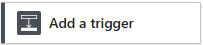</td>
</tr>
<tr>
<td>
2. Type <em>recurrence</em> into the <strong>search</strong> field
and select <strong>Recurrence</strong> in the Schedule
connector
</td>
<td>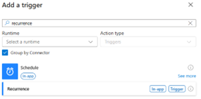</td>
</tr>
<tr>
<td>
3. Set the <strong>Interval</strong> to <em>1</em>
</td>
<td>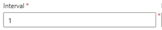</td>
</tr>
<tr>
<td>
4. Set the <strong>Frequency</strong> to <em>Month</em>
</td>
<td>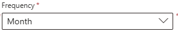</td>
</tr>
<tr>
<td>
5. Set the <strong>Time Zone</strong> to (UTC-05:00) Eastern Time
(US &amp; Canada)
</td>
<td>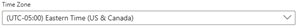 
Or whichever time zone makes sense for you</td>
</tr>
<tr>
<td>
6. Set the <strong>Start Time</strong> to
</td>
<td>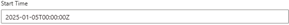 
Choose the 5th of the month, due to the date restrictions
of MGDC needing the range to be at least 2 days prior</td>
</tr>
<tr>
<td>
7. Rename the action to:
</td>
<td><em>Recurrence - Monthly</em></td>
</tr>
</table>

### 3. Add an Action for the Date Last Month – Compose / Data Operations

<table style="width: 100%">
<colgroup>
<col style="width: 43%" />
<col style="width: 56%" />
</colgroup>
<tr>
<td>1. Add an Action 🡪 Data Operations 🡪 Compose</td>
<td>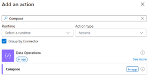</td>
</tr>
<tr>
<td>2. Use the following formula to get the last month’s date</td>
<td><em>addToTime(utcNow(),-1,'month','yyyy-MM-dd')</em></td>
</tr>
<tr>
<td>3. Rename the action to:</td>
<td><em>Compose Last Month Date</em></td>
</tr>
<tr>
<td>4. Save the Logic App</td><td/>
</tr>
</table>

### 4. Add an Action for the Start of Last Month

<table style="width: 100%">
<colgroup>
<col style="width: 43%" />
<col style="width: 56%" />
</colgroup>
<tr>
<td>1. Add an Action 🡪 Data Operations 🡪 Compose</td>
<td></td>
</tr>
<tr>
<td>2. Use the following formula to get the start of last month’s
date/time</td>
<td><em>startOfMonth(outputs</em>
<em>('Compose_Last_Month_Date'),'yyyy-MM-ddTHH:mm:ssZ')</em></td>
</tr>
<tr>
<td>3. Rename the action to:</td>
<td><em>Compose Start of Last Month</em></td>
</tr>
<tr>
<td>4. Save the Logic App</td>
<td></td>
</tr>
</table>

### 5. Add an Action for the End of Last Month

<table style="width: 100%">
<colgroup>
<col style="width: 43%" />
<col style="width: 56%" />
</colgroup>
<tr>
<td>1. Add an Action 🡪 Data Operations 🡪 Compose</td>
<td></td>
</tr>
<tr>
<td>2. Use the following formula to get the end of last month’s
date/time</td>
<td><em>formatDateTime(subtractFromTime</em>
<em>(startOfMonth(addToTime(outputs</em>
<em>('Compose_Last_Month_Date')</em>
<em>,1,'month')),1,'day'),'yyyy-MM-ddTHH:mm:ssZ')</em></td>
</tr>
<tr>
<td>3. Rename the action to:</td>
<td><em>Compose End of Last Month</em></td>
</tr>
<tr>
<td>4. Save the Logic App</td>
<td></td>
</tr>
</table>

### 6. Add an Action to call the Synapse Pipeline Endpoint for Storage

<table style="width: 100%">
<colgroup>
<col style="width: 43%" />
<col style="width: 56%" />
</colgroup>
<tr>
<td>Add an Action 🡪 HTTP 🡪 HTTP</td>
<td>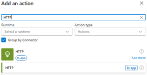</td>
</tr>
<tr>
<td>For the <strong>URI</strong>, use the following format, making
sure to account for your Synapse Workspace name and Pipeline
name</td>
<td><em>https://</em><em>{workspace name}.dev.azuresynapse.net/</em>
<em>pipelines/{pipeline name}/</em>
<em>createRun?api-version=2020-12-01</em></td>
</tr>
<tr>
<td>For the <strong>Method</strong>, select <em>POST</em></td>
<td></td>
</tr>
<tr>
<td>For the first <strong>Header key</strong>, enter</td>
<td><em>Content-Type</em></td>
</tr>
<tr>
<td>For the first <strong>Header value</strong>, enter</td>
<td><em>application/json</em></td>
</tr>
<tr>
<td>For the <strong>Body</strong> field, add the following JSON
structure, noting the relevant dates from prior actions and the
StorageAccountName and StorageContainerName
</td>
<td><em>{ 
"StartTime": "{output from Compose Start of Last Month}", 
"EndTime": "{output from Compose End of Last Month}", 
"StorageAccountName": "{Storage Account Name}", 
"StorageContainerName": "{Storage Container Name}" 
}</em></td>
</tr>
<tr>
<td>For the <strong>Advanced Parameters</strong>, select
<em>Authentication</em></td>
<td>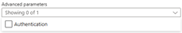</td>
</tr>
<tr>
<td>For the <strong>Authentication</strong> section that appears,
value the following:
 a. <strong>Authentication Type</strong> = <em>Managed
Identity</em>
 b. <strong>Managed Identity</strong> = <em>System-assigned managed
identity</em>
 c. <strong>Audience</strong> =
<em>https://dev.azuresynapse.net</em></td>
<td>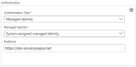</td>
</tr>
<tr>
<td>Rename the action to:</td>
<td><em>HTTP – Call Storage Synapse Pipeline</em></td>
</tr>
<tr>
<td>Save the Logic App</td>
<td></td>
</tr>
</table>

### 7. Add an Action to call the Synapse Pipeline Endpoint for Oversharing

<table style="width: 100%">
<colgroup>
<col style="width: 43%" />
<col style="width: 56%" />
</colgroup>
<tr>
<td>1. Add an Action 🡪 HTTP 🡪 HTTP</td>
<td></td>
</tr>
<tr>
<td>2. For the <strong>URI</strong>, use the following format, making
sure to account for your Synapse Workspace name and Pipeline
name</td>
<td><em>https://</em>
<em>{workspace name}.dev.azuresynapse.net/</em>
<em>pipelines/{pipeline name}/</em>
<em>createRun?api-version=2020-12-01</em></td>
</tr>
<tr>
<td>3. For the <strong>Method</strong>, select <em>POST</em></td>
<td></td>
</tr>
<tr>
<td>4. For the first <strong>Header key</strong>, enter</td>
<td><em>Content-Type</em></td>
</tr>
<tr>
<td>5. For the first <strong>Header value</strong>, enter</td>
<td><em>application/json</em></td>
</tr>
<tr>
<td>6. For the <strong>Body</strong> field, add the following JSON
structure, noting the relevant dates from prior actions and the
StorageAccountName and StorageContainerName</td>
<td><em>{ 
"StartTime": "{output from Compose Start of Last Month}", 
"EndTime": "{output from Compose End of Last Month}", 
"StorageAccountName": "{Storage Account Name}", 
"StorageContainerName": "{Storage Container Name}" 
}</em></td>
</tr>
<tr>
<td>7. For the <strong>Advanced Parameters</strong>, select
<em>Authentication</em></td>
<td></td>
</tr>
<tr>
<td>8. For the <strong>Authentication</strong> section that appears,
value the following:
 a. <strong>Authentication Type</strong> = <em>Managed
Identity</em>
 b. <strong>Managed Identity</strong> = <em>System-assigned managed
identity</em>
 c. <strong>Audience</strong> =
<em>https://dev.azuresynapse.net</em></td>
<td></td>
</tr>
<tr>
<td>9. Rename the action to:</td>
<td><em>HTTP – Call Oversharing Synapse Pipeline</em></td>
</tr>
<tr>
<td>10. Save the Logic App</td>
<td></td>
</tr>
</table>

### 8. Set Up the System Managed Identity for the Logic App

<table style="width: 100%">
<colgroup>
<col style="width: 43%" />
<col style="width: 56%" />
</colgroup>
<tr>
<td>1. From the <strong>Overview</strong> page of the Logic App, select
<em>Settings</em> 🡪 <em>Identity</em></td>
<td></td>
</tr>
<tr>
<td>2. Set the <strong>Status</strong> to <em>On</em></td>
<td>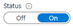</td>
</tr>
<tr>
<td>3. Note the Object/Principal Id</td>
<td>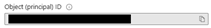</td>
</tr>
<tr>
<td>4. Save the Identity settings</td>
<td></td>
</tr>
</table>

### 9. Give the Logic App Access to the Synapse Workspace

<table style="width: 100%">
<colgroup>
<col style="width: 43%" />
<col style="width: 56%" />
</colgroup>
<tr>
<td>1. From the <strong>Overview</strong> page of the of the Synapse
Workspace, open Synapse Studio</td>
<td>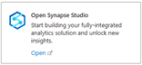</td>
</tr>
<tr>
<td>2. Select <strong>Manage</strong> 🡪
<strong>Access Control (Security)</strong></td>
<td></td>
</tr>
<tr>
<td>3. From the <strong>displayed Access Control</strong> page, select
<strong>+Add</strong></td>
<td></td>
</tr>
<tr>
<td>4. In the resultant <strong>Add Role Assignment</strong> pane
 a. <strong>Scope</strong> = <em>Workspace</em>
 b. <strong>Role</strong> = <em>Synapse Credential User</em>
 c. <strong>Select User</strong>: <em>Name of your Logic
App</em></td>
<td>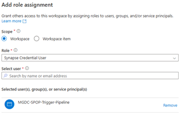</td>
</tr>
<tr>
<td>5. Select <strong>Apply</strong></td>
<td></td>
</tr>
<tr>
<td>6. The following should appear in the <strong>Access
Control</strong> list</td>
<td>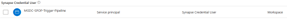</td>
</tr>
</table>